# Resume Agent Plugin

AI-powered Resume Analysis & Optimization plugin for Claude Code and Claude Cowork.

Analyzes resumes across 6 dimensions (ATS compatibility, content quality, keyword alignment, strategic positioning, structure/format, market intelligence) and produces optimized resumes with change tracking.

## Installation

```bash
claude plugin install --git https://github.com/sequenzia/resume-agent-plugin
```

Or install from a local directory:

```bash
claude plugin install --dir /path/to/resume-agent-plugin
```

## Requirements

- [uv](https://docs.astral.sh/uv/) — Python package manager (auto-installs dependencies on first session)
- Python >= 3.12

Dependencies (`pymupdf`, `jsonschema`, `typst`, `python-docx`, `fpdf2`) are installed automatically via the SessionStart hook.

**Cowork support**: In Claude Cowork VMs where `uv` and Typst are unavailable, the plugin falls back to `pip` for package management and fpdf2 for PDF rendering.

## Skills

| Skill | Description |
|-------|-------------|
| `/resume-agent:analyze-resume` | Full 6-dimension analysis pipeline |
| `/resume-agent:parse-resume` | Parse resume into structured JSON |
| `/resume-agent:ats-check` | ATS compatibility analysis |
| `/resume-agent:content-review` | Content quality analysis |
| `/resume-agent:keyword-align` | Keyword alignment (requires JD) |
| `/resume-agent:strategy-review` | Strategic positioning analysis |
| `/resume-agent:skills-research` | Market intelligence and skills demand |
| `/resume-agent:optimize-resume` | Resume rewriting with change tracking |
| `/resume-agent:export-resume` | Export resume to styled PDF or DOCX |

## Quick Start

1. Install the plugin
2. Run `/resume-agent:analyze-resume /path/to/resume.pdf`
3. Optionally provide a job description for keyword alignment
4. Review the analysis report in your workspace session directory
5. Run `/resume-agent:optimize-resume` for rewritten content
6. Run `/resume-agent:export-resume` to export as PDF or DOCX

## Architecture

The plugin orchestrates 8 specialized subagents:

- **resume-parser** — Extracts structured data from PDF/Markdown
- **ats-analyzer** — Evaluates ATS compatibility with platform simulation
- **content-analyst** — Scores bullet points and content quality
- **keyword-optimizer** — Analyzes keyword alignment against job descriptions
- **strategy-advisor** — Detects career archetype and strategic positioning
- **skills-research** — Market demand analysis and terminology verification
- **interview-researcher** — Background research during optimization interview
- **resume-rewriter** — Produces optimized resume content (Opus model)

### Pipeline

```mermaid
flowchart LR
    subgraph analyze["analyze-resume"]
        A[Parse]:::primary -->|sequential| B[Parallel Analysis]:::secondary
        B --> C[Score]:::success
        C --> D[Report]:::success
    end
    subgraph optimize["optimize-resume"]
        E[Interview]:::primary --> F[Rewrite]:::warning --> G[Approval]:::success
    end
    subgraph export["export-resume"]
        H[Format Select]:::primary --> I[Render]:::secondary --> J[ATS Validate]:::success
    end
    D -.-> E
    G -.-> H

    classDef primary fill:#dbeafe,stroke:#2563eb,color:#000
    classDef secondary fill:#f3e8ff,stroke:#7c3aed,color:#000
    classDef success fill:#dcfce7,stroke:#16a34a,color:#000
    classDef warning fill:#fef3c7,stroke:#d97706,color:#000
```



### Export Formats

- **PDF** — 4 presets (Classic, Modern, Compact, Harvard) via Typst templates, with fpdf2 fallback for Cowork
- **DOCX** — 4 presets (Professional, Simple, Creative, Academic) via python-docx, plus custom template support
- Post-export ATS validation ensures text extraction fidelity and heading preservation

## Scoring

Scores are computed across 6 dimensions with configurable weights (see `skills/analyze-resume/scoring-rubric.json`).

### With Job Description

| Dimension | Weight |
|-----------|--------|
| ATS Compatibility | 18% |
| Keyword Alignment | 22% |
| Content Quality | 22% |
| Strategic Positioning | 13% |
| Structure & Format | 12% |
| Market Intelligence | 13% |

### Without Job Description

| Dimension | Weight |
|-----------|--------|
| ATS Compatibility | 22% |
| Content Quality | 26% |
| Strategic Positioning | 22% |
| Structure & Format | 17% |
| Market Intelligence | 13% |

## Safety

- Never fabricates metrics or achievements — uses `[X]` placeholders
- All resume data stays in the local `workspace/` directory
- Honest scoring — scores reflect genuine assessment
- Missing data is acknowledged, not guessed

## Known Issues

- **Version mismatch**: `plugin.json` (0.4.0) and `pyproject.toml` (1.0.0) have different version numbers
- **Pyright type errors**: 13 errors (PyMuPDF return types, importlib patterns). All tests pass.
- **PDF/A in fallback**: `pdf_a=True` is silently ignored by the fpdf2 backend — only Typst supports PDF/A-2b

## License

Fonts in `fonts/` are licensed under the SIL Open Font License.
