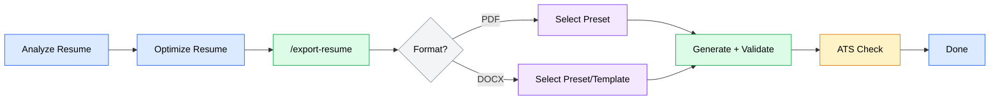
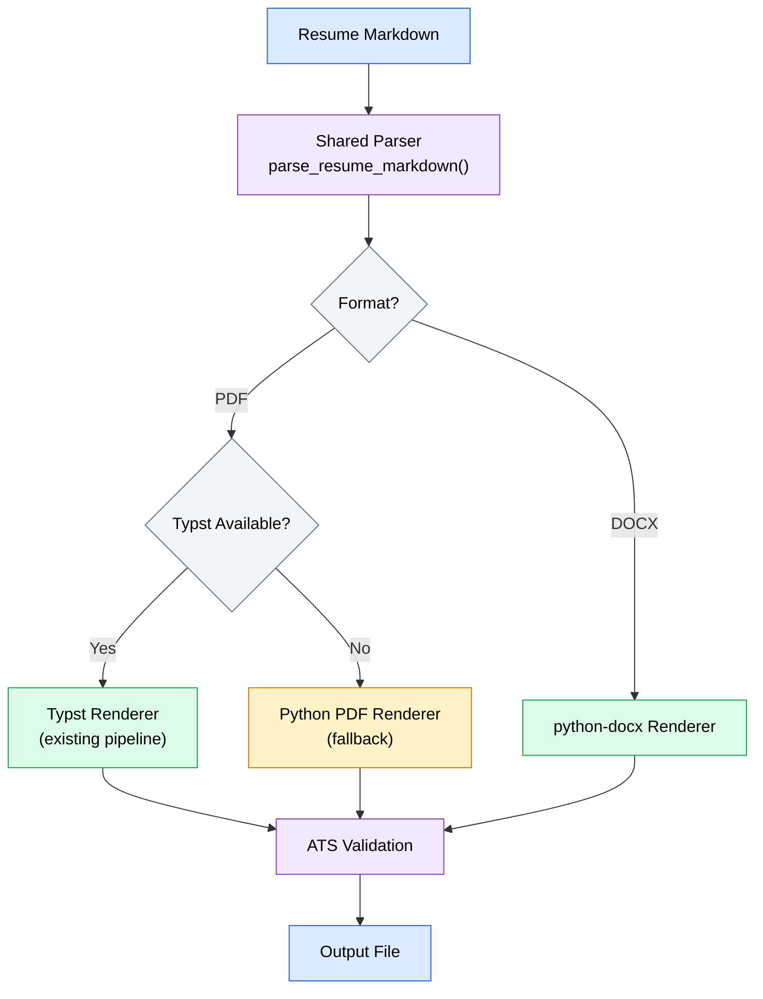

# cowork-exports PRD

**Version**: 1.0
**Author**: Stephen Sequenzia
**Date**: 2026-03-14
**Status**: Draft
**Spec Type**: New feature
**Spec Depth**: Detailed specifications
**Description**: Add export-to-pdf and export-to-word capabilities to the resume-agent plugin, replacing the existing export-pdf skill with a unified export-resume skill that works in both Claude Code and Claude Cowork environments.

---

## 1. Executive Summary

This feature introduces a unified `/export-resume` skill that replaces the existing `/export-pdf` skill with two export formats: PDF and Word (DOCX). The implementation must work seamlessly in both Claude Code and Claude Cowork environments, using Typst for PDF generation when available and falling back to pure Python PDF generation in Cowork's isolated VM. Word export uses `python-docx` with both bundled and user-provided templates.

## 2. Problem Statement

### 2.1 The Problem

The resume-agent plugin can only export optimized resumes as PDF via Typst. Users need Word/DOCX export for ATS submission, further manual editing, and sharing with recruiters. Additionally, the current Typst-based PDF export may not work in Claude Cowork's isolated Linux VM where Typst isn't pre-installed.

### 2.2 Current State

- **PDF export exists** via the `export-pdf` skill using `scripts/md-to-pdf.py` and Typst templates
- **No Word export** capability exists anywhere in the plugin
- **Cowork incompatibility**: The current export depends on `uv` and `typst` being available on the host system, which is not guaranteed in Cowork's VM environment
- Users who need DOCX format must manually convert the PDF or copy-paste from the optimized markdown

### 2.3 Impact Analysis

- Job seekers submitting through ATS systems that prefer `.docx` format cannot directly use the plugin's output
- Users who want to make manual edits post-optimization must work with markdown or PDF (neither is ideal for non-technical users)
- Recruiters and career coaches receiving resumes expect `.docx` or `.pdf` — the plugin only delivers one of these
- Cowork users (knowledge workers, the primary non-developer audience) may not be able to use PDF export at all

### 2.4 Business Value

- Completes the resume optimization pipeline with industry-standard export formats
- Extends plugin reach to Claude Cowork's knowledge-worker audience
- Addresses the most common resume submission formats (PDF + DOCX)
- Reduces friction in the analyze → optimize → export → submit workflow

## 3. Goals & Success Metrics

### 3.1 Primary Goals
1. Replace the existing `export-pdf` skill with a unified `export-resume` skill supporting both PDF and DOCX
2. Ensure the skill works in both Claude Code and Claude Cowork environments
3. Produce professional, ATS-compatible output in both formats

### 3.2 Success Metrics

| Metric | Current Baseline | Target | Measurement Method |
|--------|------------------|--------|-------------------|
| Export format support | PDF only | PDF + DOCX | Feature parity check |
| Cowork compatibility | Not tested | Works without errors | Manual testing in Cowork VM |
| ATS parseability | PDF only (text layer) | Both formats parseable | Post-export validation pass |
| Export time | ~3s (PDF via Typst) | <10s per format | Timed runs on sample resumes |

### 3.3 Non-Goals
- Other export formats (HTML, RTF, plain text)
- Visual template editor or customization UI
- Cloud storage integration (Google Drive, Dropbox, etc.)
- Batch export of multiple resumes at once
- Real-time preview of export output

## 4. User Research

### 4.1 Target Users

#### Primary Persona: Job Seeker (Cowork)
- **Role/Description**: Non-technical professional using Claude Cowork to optimize their resume
- **Goals**: Export polished resume in format required by job application portals
- **Pain Points**: Most ATS systems prefer .docx; currently must leave the plugin to convert formats
- **Context**: Using Cowork Desktop app, expects one-click export without terminal knowledge

#### Secondary Persona: Job Seeker (Claude Code)
- **Role/Description**: Technical professional using Claude Code in terminal
- **Goals**: Quick export to PDF or DOCX after optimization
- **Pain Points**: Current export-pdf skill works but lacks DOCX option
- **Context**: Comfortable with CLI, values speed and customization

#### Tertiary Persona: Career Coach / Recruiter
- **Role/Description**: Professional receiving resumes from candidates who used the plugin
- **Goals**: Receive well-formatted, editable resumes they can annotate or forward
- **Pain Points**: PDFs are hard to edit; needs DOCX for markup and comments
- **Context**: Receives exported files from users, does not interact with plugin directly

### 4.2 User Journey Map



## 5. Functional Requirements

### 5.1 Feature: Unified Export Skill

**Priority**: P0 (Critical)

#### User Stories

**US-001**: As a job seeker, I want a single `/export-resume` command that lets me choose between PDF and DOCX so that I don't need to remember separate commands.

**Acceptance Criteria**:
- [ ] `/export-resume` replaces the existing `/export-pdf` skill
- [ ] The skill prompts for format selection (PDF or DOCX) via `AskUserQuestion`
- [ ] Auto-detects the most recent session's `optimized-resume.md` when no path is provided
- [ ] Accepts an explicit file path to any markdown resume file
- [ ] Outputs the exported file to the same session directory (if in a session) or alongside the source file
- [ ] Reports file path, size, preset used, and any customizations on success

**Edge Cases**:
- No session found and no path provided: Prompt user to provide a path or run `/optimize-resume` first
- Multiple sessions exist: Use the most recent session with `optimized-resume.md`
- Explicit path to non-session markdown: Write export alongside the source file
- Invalid markdown structure: Report warnings but still attempt export

---

### 5.2 Feature: PDF Export (Enhanced)

**Priority**: P0 (Critical)

#### User Stories

**US-002**: As a job seeker, I want to export my resume as a professionally formatted PDF with style presets so that I can submit a polished document.

**US-003**: As a Cowork user, I want PDF export to work without requiring Typst installation so that I can use the feature without troubleshooting dependencies.

**Acceptance Criteria**:
- [ ] Supports all 4 existing presets: Modern, Classic, Compact, Harvard
- [ ] Supports all existing customization options: font, accent color, page size, margins, line spacing, section spacing, PDF/A compliance
- [ ] When Typst is available (Claude Code): Uses existing Typst-based pipeline
- [ ] When Typst is unavailable (Cowork VM): Falls back to pure Python PDF generation
- [ ] Python fallback produces visually comparable output for all 4 presets
- [ ] Generated PDF has a native text layer for ATS compatibility
- [ ] Embedded fonts for consistent cross-platform rendering

**Edge Cases**:
- Typst binary exists but fails at runtime: Fall back to Python generation with a warning
- Python fallback library not installed: Report clear error with install instructions
- Resume exceeds 30MB file size limit (Cowork): Warn user and suggest reducing content

---

### 5.3 Feature: Word/DOCX Export

**Priority**: P0 (Critical)

#### User Stories

**US-004**: As a job seeker, I want to export my resume as a Word document so that I can submit it to ATS systems that prefer .docx format.

**US-005**: As a job seeker, I want Word-specific style presets so that my DOCX export looks professional and is optimized for the Word format.

**US-006**: As a job seeker, I want to use my own Word template so that the export matches my company's or personal branding.

**Acceptance Criteria**:
- [ ] Generates valid .docx files using `python-docx`
- [ ] Supports 4 Word-specific presets: Professional, Simple, Creative, Academic
- [ ] Each preset applies appropriate fonts, spacing, heading styles, and color scheme
- [ ] Users can provide a custom .docx template file as an alternative to presets
- [ ] Custom templates preserve the template's styles while injecting resume content
- [ ] Document structure maps correctly from markdown: H1 → name, H2 → section headings, H3 → subsection headings, bullets → list items, bold/italic/links preserved
- [ ] Contact information rendered as header or first section
- [ ] Tables (e.g., skills matrices) converted to Word tables
- [ ] Output is ATS-parseable (no text boxes, images, or headers/footers that hide content)

**Edge Cases**:
- Custom template has incompatible styles: Fall back to preset styling with a warning
- Custom template file not found: Report error and offer preset selection instead
- Resume content overflows single page in narrow preset: Warn user about page count
- Markdown contains unsupported elements (code blocks, images): Skip gracefully with warning

---

### 5.4 Feature: Post-Export ATS Validation

**Priority**: P1 (High)

#### User Stories

**US-007**: As a job seeker, I want the export to verify my document is ATS-parseable so that I can be confident my resume won't be rejected by automated systems.

**Acceptance Criteria**:
- [ ] After generating PDF: Extract text using `extract-pdf-text.py` (or Python equivalent in Cowork) and verify content is present
- [ ] After generating DOCX: Extract text using `python-docx` and verify content round-trips correctly
- [ ] Check that all section headings from the source markdown appear in the exported document
- [ ] Check that no content was silently dropped during conversion
- [ ] Report validation result: pass/fail with specific issues if any
- [ ] Validation runs automatically after export (not opt-in)

**Edge Cases**:
- Validation fails but export succeeded: Report the issue and suggest the user review the file
- PDF text extraction returns garbled text: Flag potential font embedding issue
- DOCX validation shows missing sections: Report which sections were lost

---

### 5.5 Feature: Environment Detection

**Priority**: P0 (Critical)

#### User Stories

**US-008**: As a plugin developer, I want the plugin to automatically detect whether it's running in Claude Code or Cowork so that it uses the correct PDF generation approach.

**Acceptance Criteria**:
- [ ] Setup hook (`setup-deps.sh` or equivalent) detects the runtime environment
- [ ] Checks for `uv` availability; if missing, uses `pip` or pre-installed packages
- [ ] Checks for Typst availability; sets a flag indicating which PDF backend to use
- [ ] Installs `python-docx` and Python PDF fallback library as dependencies
- [ ] Environment detection results are available to the export skill at runtime
- [ ] No user intervention required — detection and fallback are automatic

**Edge Cases**:
- Neither `uv` nor `pip` available: Report error with manual installation instructions
- Partial environment (e.g., `uv` available but `typst` compilation fails): Use fallback
- Cowork VM has updated dependencies between sessions: Re-detect each session

## 6. Non-Functional Requirements

### 6.1 Performance
- PDF export via Typst: <5 seconds for a typical 2-page resume
- PDF export via Python fallback: <10 seconds for a typical 2-page resume
- DOCX export: <5 seconds for a typical 2-page resume
- ATS validation: <3 seconds per file

### 6.2 Compatibility
- Claude Code on macOS, Linux, Windows
- Claude Cowork on macOS and Windows (Desktop app)
- Python >= 3.12
- Generated PDFs viewable in all major PDF readers
- Generated DOCX files compatible with Microsoft Word 2016+, Google Docs, LibreOffice

### 6.3 File Size
- Generated files must stay under 30MB (Cowork limit)
- Typical resume PDF: 50-200 KB
- Typical resume DOCX: 20-100 KB

## 7. Technical Considerations

### 7.1 Architecture Overview

The export system uses a **shared parser + format-specific renderers** pattern. The existing `parse_resume_markdown()` function in `scripts/md-to-pdf.py` serves as the shared parser, producing structured resume data. Two renderer pipelines consume this data:

1. **PDF Renderer**: Typst (primary) → Python fallback (when Typst unavailable)
2. **DOCX Renderer**: python-docx with template-based generation



### 7.2 Tech Stack
- **Shared Parser**: Python (existing `parse_resume_markdown()`)
- **PDF (primary)**: Typst + bundled `.typ` templates
- **PDF (fallback)**: Pure Python library (weasyprint, reportlab, or fpdf2 — to be determined)
- **DOCX**: `python-docx` library
- **Validation**: `pymupdf` for PDF text extraction, `python-docx` for DOCX text extraction
- **Environment**: Python >= 3.12, `uv` (Claude Code) or system Python (Cowork VM)

### 7.3 Integration Points

| System | Integration Type | Purpose |
|--------|-----------------|---------|
| `scripts/md-to-pdf.py` | Refactor | Extract shared parser; keep Typst renderer |
| `scripts/extract-pdf-text.py` | Reuse | PDF text extraction for ATS validation |
| `skills/export-pdf/SKILL.md` | Replace | Remove and replace with `skills/export-resume/SKILL.md` |
| `hooks/setup-deps.sh` | Modify | Add environment detection and new dependency installation |
| `pyproject.toml` | Modify | Add `python-docx` and PDF fallback library to dependencies |
| `templates/pdf/*.typ` | Keep | Existing Typst templates remain unchanged |
| `templates/word/*.docx` | New | Bundled Word template files |
| `fonts/` | Keep | Bundled fonts used by both PDF and DOCX renderers |

### 7.4 Technical Constraints
- Cowork VM is an isolated Linux environment — cannot assume system-level dependencies
- 30MB file size limit per file in Cowork
- `python-docx` cannot apply arbitrary fonts not installed on the system; Word-bundled templates should use common fonts or embed them
- Python PDF fallback may not produce pixel-identical output to Typst — "visually comparable" is the target
- Custom user templates must follow certain structural conventions for content injection to work

### 7.5 Codebase Context

#### Existing Architecture

The plugin follows a skills → agents → scripts architecture. Skills define user-facing commands via SKILL.md files with YAML frontmatter. Python scripts in `scripts/` handle computation and file generation, invoked via `uv run` from Bash.

#### Integration Points

| File/Module | Purpose | How This Feature Connects |
|------------|---------|---------------------------|
| `skills/export-pdf/SKILL.md` | Current PDF export skill | Replaced by `skills/export-resume/SKILL.md` |
| `scripts/md-to-pdf.py` | Markdown → PDF via Typst | Refactored: parser extracted to shared module; Typst renderer stays |
| `scripts/extract-pdf-text.py` | PDF text extraction | Reused for post-export ATS validation (PDF) |
| `hooks/setup-deps.sh` | Dependency installation on session start | Modified to add environment detection and new deps |
| `hooks/hooks.json` | Hook configuration | May need updates if new hooks are added |
| `templates/pdf/*.typ` | 4 Typst PDF templates | Unchanged; new `templates/word/` added alongside |
| `pyproject.toml` | Project dependencies | Updated with new dependencies |
| `fonts/` | Bundled font files | Used by both PDF and DOCX renderers |

#### Patterns to Follow
- **Skill structure**: YAML frontmatter with `name`, `description`, `allowed-tools`, `disable-model-invocation` — used in all existing skills
- **Script invocation**: `uv run --directory ${CLAUDE_PLUGIN_ROOT} ${CLAUDE_PLUGIN_ROOT}/scripts/<script>.py <args>` — used by `export-pdf`, `analyze-resume`
- **User interaction via AskUserQuestion**: Multi-step preset and customization flow — used by `export-pdf`
- **Session directory convention**: `workspace/output/YYYY-MM-DD-HHMMSS/` — used by all skills

#### Related Features
- **`export-pdf` skill**: Direct predecessor; workflow and UX patterns should be preserved and extended
- **`optimize-resume` skill**: Upstream producer of `optimized-resume.md`; export-resume consumes its output
- **`analyze-resume` skill**: Orchestrator that produces analysis files; ATS validation reuses similar logic

## 8. Scope Definition

### 8.1 In Scope
- Unified `/export-resume` skill with PDF and DOCX format selection
- PDF export with Typst (primary) and Python fallback (Cowork)
- DOCX export with `python-docx` and 4 Word-specific presets
- Bundled `.docx` template files for each preset
- Custom user-provided `.docx` template support
- Post-export ATS validation for both formats
- Environment detection for Cowork/Code compatibility
- Clean removal of the existing `export-pdf` skill
- Auto-detection of session `optimized-resume.md` + explicit path support
- All existing PDF customization options preserved

### 8.2 Out of Scope
- **Other export formats** (HTML, RTF, plain text): Not requested; can be added later
- **Visual template editor**: No GUI for template customization
- **Cloud storage integration**: No direct upload to Google Drive, Dropbox, etc.
- **Batch export**: No exporting multiple resumes at once
- **Real-time preview**: No live preview of export output before generation

### 8.3 Future Considerations
- HTML export for web portfolios
- Direct email integration (send resume via Gmail/Outlook)
- Template marketplace where users can share custom templates
- Batch export for career coaches managing multiple clients

## 9. Implementation Plan

### 9.1 Phase 1: Foundation — Shared Parser & Skill Skeleton

**Completion Criteria**: Shared parser is extracted, unified skill skeleton is in place, environment detection works.

| Deliverable | Description | Dependencies |
|-------------|-------------|--------------|
| Extract shared parser | Refactor `parse_resume_markdown()` out of `md-to-pdf.py` into `scripts/parse_resume.py` (importable module) | None |
| Unified skill definition | Create `skills/export-resume/SKILL.md` with format selection, preset flow, and input auto-detection | Shared parser |
| Environment detection | Update `hooks/setup-deps.sh` to detect Typst/uv availability and set environment flags | None |
| Remove `export-pdf` | Delete `skills/export-pdf/SKILL.md` | Unified skill ready |
| Update dependencies | Add `python-docx` and Python PDF fallback library to `pyproject.toml` | None |

**Checkpoint Gate**: Verify shared parser produces identical output to current inline parser. Verify environment detection correctly identifies Claude Code vs Cowork.

---

### 9.2 Phase 2: Word Export — Renderer & Templates

**Completion Criteria**: DOCX export works with all 4 presets and custom templates.

| Deliverable | Description | Dependencies |
|-------------|-------------|--------------|
| DOCX renderer script | Create `scripts/md-to-docx.py` consuming shared parser output and producing .docx files | Phase 1: shared parser |
| Professional preset template | `templates/word/professional.docx` — clean business formatting | None |
| Simple preset template | `templates/word/simple.docx` — minimal styling, maximum ATS compatibility | None |
| Creative preset template | `templates/word/creative.docx` — more visual design elements | None |
| Academic preset template | `templates/word/academic.docx` — CV-style for research/education | None |
| Custom template support | Logic to load user-provided .docx template and inject resume content | DOCX renderer |
| DOCX customization flow | Add Word preset selection and custom template path to skill SKILL.md | Phase 1: skill skeleton |

**Checkpoint Gate**: Review generated DOCX files for styling quality, ATS parseability, and correct content mapping. Test custom template injection with a sample user template.

---

### 9.3 Phase 3: PDF Fallback — Python Renderer for Cowork

**Completion Criteria**: PDF export works in Cowork VM without Typst.

| Deliverable | Description | Dependencies |
|-------------|-------------|--------------|
| Python PDF renderer | Create fallback PDF generation path in `scripts/md-to-pdf.py` (or separate script) using Python library | Phase 1: shared parser |
| Preset parity | Python fallback supports all 4 PDF presets with visually comparable output | Python PDF renderer |
| Customization support | Python fallback supports font, color, margin, page size, line spacing, section spacing options | Python PDF renderer |
| Environment-aware routing | Skill logic routes to Typst or Python fallback based on environment detection | Phase 1: environment detection |
| Font handling | Ensure bundled fonts work with the Python PDF library | Font directory |
| Setup hook update | Final `setup-deps.sh` that installs correct dependencies per environment | Phase 1: environment detection |

**Checkpoint Gate**: Test PDF generation in both Claude Code (Typst path) and Cowork VM (Python path). Compare output quality across all 4 presets.

---

### 9.4 Phase 4: Validation & Polish

**Completion Criteria**: Post-export ATS validation works, edge cases handled, documentation updated.

| Deliverable | Description | Dependencies |
|-------------|-------------|--------------|
| PDF ATS validation | Extract text from generated PDF and verify content completeness | Phase 3: PDF generation |
| DOCX ATS validation | Extract text from generated DOCX and verify content round-trip | Phase 2: DOCX generation |
| Validation integration | Wire validation into the export skill flow (automatic after export) | Validation scripts |
| Edge case handling | Handle missing files, invalid templates, oversized output, garbled text | All phases |
| CLAUDE.md update | Update project CLAUDE.md with new skill, scripts, templates, and architecture changes | All phases |
| plugin.json update | Update version if needed | All phases |

**Checkpoint Gate**: Full end-to-end testing: analyze → optimize → export (both formats) → validate. Test in both Claude Code and Cowork environments.

## 10. Dependencies

### 10.1 Technical Dependencies

| Dependency | Status | Risk if Delayed |
|------------|--------|-----------------|
| `python-docx` library | Available on PyPI | Low — well-maintained, stable API |
| Python PDF fallback library (TBD) | Needs evaluation | Medium — choice affects Phase 3 timeline |
| Cowork VM test environment | Requires Desktop app | Medium — can't validate Cowork path without it |
| Bundled font compatibility | Needs testing per library | Low — fonts are standard TTF/OTF |

### 10.2 External Dependencies

| System | Dependency | Status |
|--------|------------|--------|
| Cowork VM | Python 3.12+ pre-installed | Assumed available |
| Cowork VM | pip or package installer available | Needs verification |
| Typst | Available in Claude Code environments | Currently working |

## 11. Risks & Mitigations

| Risk | Impact | Likelihood | Mitigation Strategy |
|------|--------|------------|---------------------|
| Styling fidelity in Word | High | Medium | Invest in high-quality bundled templates; test across Word, Google Docs, LibreOffice |
| Maintenance burden of two formats | Medium | High | Shared parser architecture minimizes duplication; format-specific code is isolated to renderers |
| Typst unavailable in Cowork VM | High | High | Python PDF fallback ensures functionality regardless of environment |
| Python PDF fallback quality gap | Medium | Medium | Evaluate multiple libraries; accept "visually comparable" rather than pixel-identical |
| Custom template injection failures | Medium | Medium | Validate template structure before injection; fall back to preset with warning |
| Cowork VM dependency installation issues | High | Medium | Multiple fallback paths (uv → pip → pre-installed); clear error messages |

## 12. Open Questions

| # | Question | Resolution |
|---|----------|------------|
| 1 | Which Python PDF library for the fallback? (weasyprint vs reportlab vs fpdf2) | Evaluate during Phase 3; weasyprint has best CSS support but heaviest dependency; reportlab is most battle-tested; fpdf2 is lightest |
| 2 | Should the Python PDF fallback support all customization options or a subset? | Target full parity; accept partial if library limitations prevent it |
| 3 | What Python packages are pre-installed in the Cowork VM? | Test during Phase 1 environment detection work |
| 4 | Should custom Word templates require specific style names (e.g., "Heading 1", "Normal")? | Define template contract during Phase 2 |

## 13. Appendix

### 13.1 Glossary

| Term | Definition |
|------|------------|
| ATS | Applicant Tracking System — software used by employers to filter and rank resumes |
| Cowork | Claude Cowork — Anthropic's Desktop app for knowledge workers, runs Claude in an isolated VM |
| DOCX | Microsoft Word Open XML Document format (.docx) |
| Typst | A modern typesetting system used for PDF generation |
| python-docx | Python library for creating and modifying Word (.docx) files |
| Preset | A predefined set of styling options (fonts, colors, spacing) for export templates |

### 13.2 Word Preset Specifications

| Preset | Font | Heading Color | Use Case |
|--------|------|---------------|----------|
| Professional | Calibri | Navy (#2B547E) | Corporate and business roles |
| Simple | Arial | Black (#000000) | Maximum ATS compatibility |
| Creative | Georgia | Teal (#008080) | Design, marketing, creative roles |
| Academic | Times New Roman | Dark Gray (#333333) | Research, education, CV-style |

### 13.3 File Structure Changes

```
resume-agent-plugin/
├── skills/
│   ├── export-pdf/          # REMOVED
│   │   └── SKILL.md
│   └── export-resume/       # NEW
│       └── SKILL.md
├── scripts/
│   ├── parse_resume.py      # NEW — shared parser module
│   ├── md-to-pdf.py         # MODIFIED — imports shared parser, adds Python fallback
│   └── md-to-docx.py        # NEW — DOCX renderer
├── templates/
│   ├── pdf/                 # UNCHANGED
│   │   ├── classic.typ
│   │   ├── modern.typ
│   │   ├── compact.typ
│   │   └── harvard.typ
│   └── word/                # NEW
│       ├── professional.docx
│       ├── simple.docx
│       ├── creative.docx
│       └── academic.docx
├── hooks/
│   └── setup-deps.sh        # MODIFIED — environment detection
└── pyproject.toml            # MODIFIED — new dependencies
```

### 13.4 References
- [Create and edit files with Claude](https://support.claude.com/en/articles/12111783-create-and-edit-files-with-claude)
- [Get started with Cowork](https://support.claude.com/en/articles/13345190-get-started-with-cowork)
- [Use plugins in Cowork](https://support.claude.com/en/articles/13837440-use-plugins-in-cowork)
- [python-docx documentation](https://python-docx.readthedocs.io/)
- [Typst documentation](https://typst.app/docs/)
- [Anthropic Knowledge Work Plugins](https://github.com/anthropics/knowledge-work-plugins)

---

*Document generated by SDD Tools*
